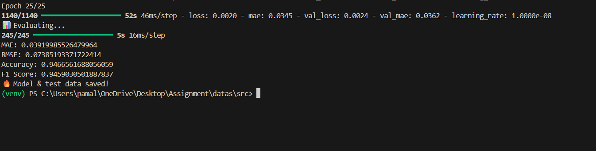
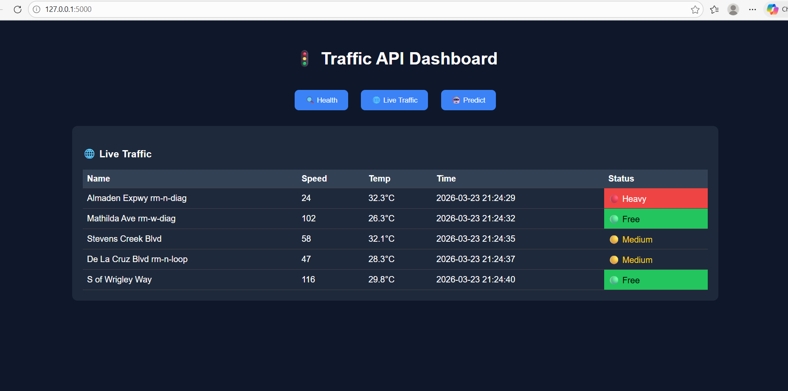

# 🚦 Real-Time Traffic Prediction System
---
## 📁 Project Structure

```
## 📁 Project Structure

```
## 📁 Project Structure

```
DATAS/
│
├── data/
│   ├── adj_mx_bay.pkl          # Adjacency matrix (graph structure)
│   ├── data.csv                # Main processed dataset
│   ├── locations.csv           # Sensor locations (lat, lon, name)
│   ├── pems-bay-meta.h5        # Metadata file (raw dataset)
│   ├── pems-bay.h5             # Raw traffic dataset
│   ├── stream_predictions.csv  # Real-time predictions from Kafka consumer
│
├── models/
│   ├── best_model.keras                # Best saved model
│   ├── traffic_bilstm_attention.keras  # Final trained model
│   ├── scaler.save                    # MinMaxScaler
│   ├── X_test.npy                     # Test input data
│   ├── y_test.npy                     # Test labels
│
├── src/
│   ├── extract.py     # Extracts .h5 → CSV
│   ├── filling.py     # Handles missing values
│   ├── model.py       # Model training
│   ├── predict.py     # Offline prediction
│   ├── producer.py    # Kafka producer
│   ├── consumer.py    # Kafka consumer
│   ├── visual.py      # Data visualization (EDA)
│   ├── dashboard.py   # Streamlit dashboard
│
├── templates/
│   └── index.html     # Frontend UI
│
├── test/
│   ├── test_api.py    # API testing
│   ├── test.py        # Additional testing
│
├── .env
├── .gitignore
├── app.py
├── compose.yml
├── README.md
```
## ⚙️ Prerequisites

* Python 3.10+
* Docker & Docker Compose
Download docker desktop from : https://docs.docker.com/desktop/setup/install/windows-install/
* OS Tested: Windows 10 / Linux
* TomTom API Key (or HERE Maps API)

### 🔑 API Setup

Create `.env` file:
 go to website : https://developer.tomtom.com/
 signup and go to api web page  and create one free tier api 
```
TOMTOM_API_KEY=your_api_key_here
```

---

## ⚙️ Environment Setup

It is recommended to create a virtual environment before installing dependencies.

### 🪟 Windows

```bash
python -m venv venv
venv\Scripts\activate
```

---

### 🐧 Linux / Mac

```bash
python3 -m venv venv
source venv/bin/activate
```

---

## 📦 Install Requirements

Install all dependencies using:

```bash
pip install -r requirements.txt
```

---

## 📁 Requirements File

The project dependencies are listed in `requirements.txt`, including:

* TensorFlow (for model training & prediction)
* Scikit-learn (for preprocessing)
* Kafka-python (for streaming)
* Flask (for API)
* Streamlit & Plotly (for dashboard)
* Requests (for external API integration)
* Pytest (for testing)

---

## 🔍 Verify Installation

Run the following to check:

```bash
pip list
```

Or test:

```bash
python app.py
```
If no errors appear, setup is successful ✅

---

## 🐳 Kafka Setup

Start Kafka and Zookeeper:

```bash
docker-compose up -d
```

---

## 📊 Dataset Setup

### 🔗 Download Dataset

* PEMS-BAY: https://www.kaggle.com/datasets/scchuy/pemsbay
 and save .h5 and .pkl files in data folder

---

### 📂 Steps

1. Download raw dataset files from kaggel 
2. Extract files into project folder
3. Convert `.h5` files to CSV using:

```bash
python src/extract.py
```

---

### 🧹 Data Preprocessing

* Handle missing values:

```bash
python src/filling.py
```

* Normalize data using MinMaxScaler
* Select sensor features
* Generate time-series sequences

---

## 🧠 Training the Model

Run training:

```bash
python src/model.py
```

### 📌 Output

* Model → `models/traffic_bilstm_attention.keras`
* Scaler → `models/scaler.save`

👉 Model Used:

* BiLSTM + Attention
* Time-series prediction (12-step input)
the results looks like this at terminal 
  Run predict.py to show is the model giving correct output or not 
 in this we can see the actual adn predicted values 
---

## 🔄 Starting Kafka Pipeline

### ▶️ Start Producer

```bash
python src/producer.py
```

👉 Streams traffic data to Kafka topic

---

### ▶️ Start Consumer

```bash
python src/consumer.py
```

👉 Performs:

* Real-time prediction
* Error calculation
* Saves results → `data/stream_predictions.csv`

---

## 🌐 Running Flask API

Start API:

```bash
python app.py
```

Open:

```
http://127.0.0.1:5000
```

---

### 🔥 Sample cURL Request

```bash
curl -X POST http://127.0.0.1:5000/predict \
-H "Content-Type: application/json" \
-d "{\"sequence\": [[70],[65],[60],[75],[80],[72],[68],[66],[64],[63],[61],[60]]}"
```

---

### 📡 Available Endpoints

| Endpoint      | Method | Description                    |
| ------------- | ------ | ------------------------------ |
| /health       | GET    | Service status                 |
| /predict      | POST   | Predict traffic speed          |
| /live-traffic | GET    | Real-time traffic (TomTom API) |



---

## 📊 Launching Dashboard

```bash
streamlit run src/dashboard.py
```

Open:

```
http://localhost:8501
```

### 📈 Dashboard Features

* Real-time traffic monitoring
* Predicted vs actual graph
* Congestion visualization
* Map-based traffic view

---

## 🧪 Running Tests

```bash
pytest test/
```

### ✔️ Tests Included

* Health endpoint test
* Prediction API test
* Live traffic API test

---

---

## 🚀 System Workflow

1. Dataset downloaded & preprocessed
2. Model trained using BiLSTM
3. Kafka streams real-time data
4. Consumer predicts traffic
5. Flask API serves predictions
6. Dashboard visualizes results

---

## 🧠 Tech Stack

* Python, TensorFlow, Scikit-learn
* Kafka, Docker
* Flask, Streamlit
* Plotly, Pandas

---

## 👨‍💻 Author

Bhogathi Kalpana
kalpanabhogathi@gmail.com
